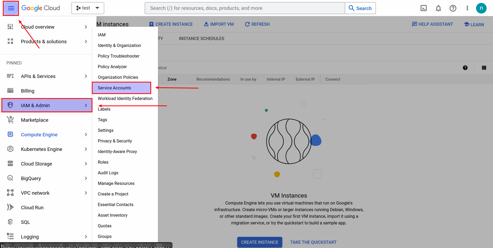
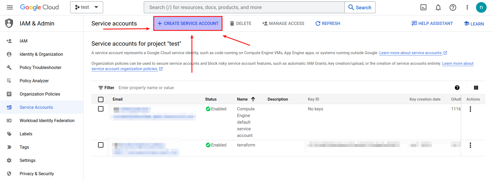
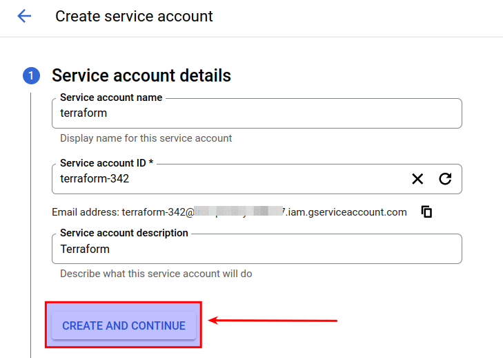
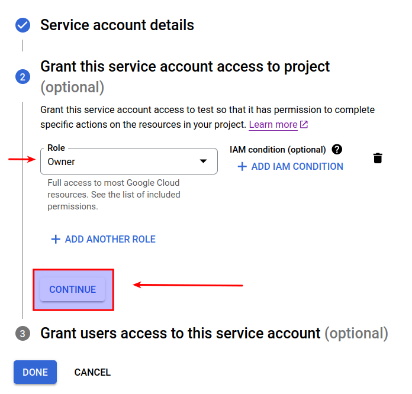
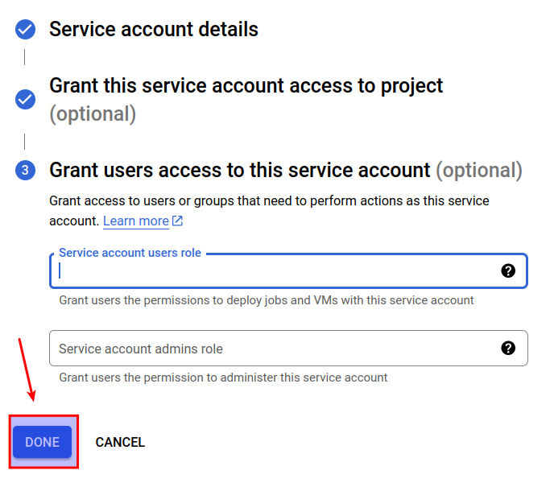
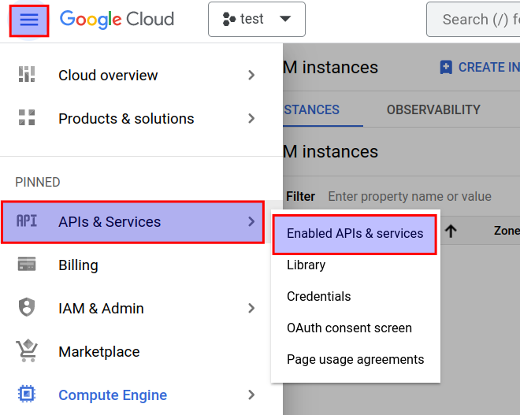
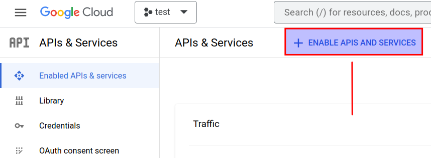
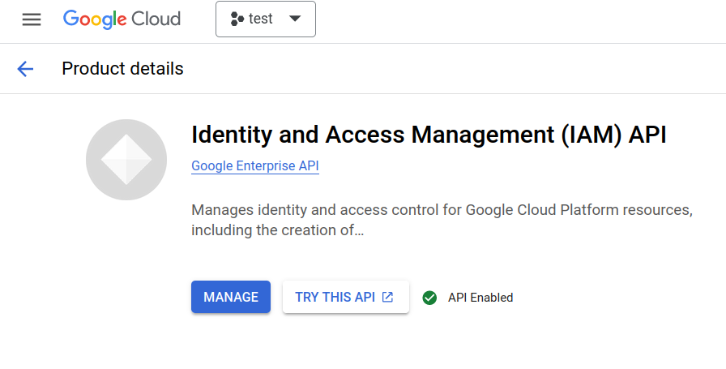
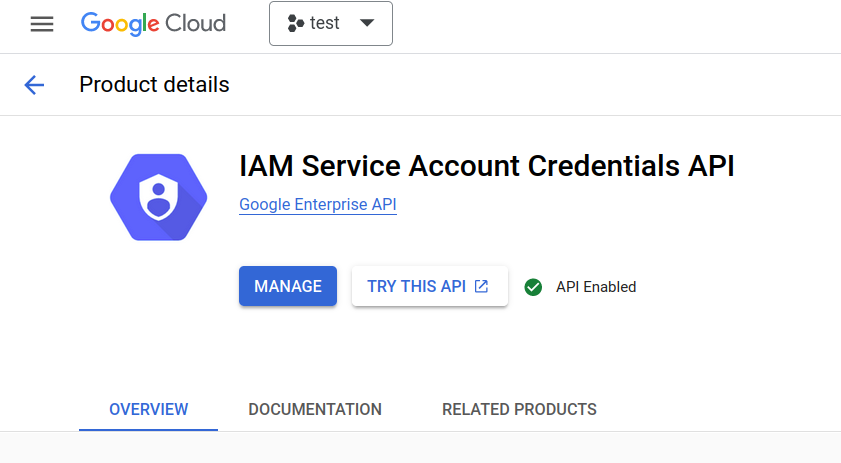

# Terraform to create Compute Instance on GCP

Be sure to read the [docs](https://cloud.google.com/free) to choose your region and other parameters for free tier.

## Table of Content
* [Prerequisites](#prerequisites)
     * [Service Account](#service-account)
     * [Enable APIs](#enable-apis)
     * [Credential File](#create-the-credentials-file)
* [Usage](#usage)
* [Files](#files)

## Prerequisites
### `gcloud` cli installed
### Service Account
1. In the GCP Console, click on the top-left '3 bars' icon.
2. Go to `IAM & Admin`.
3. Go to `Service Accounts`.



4. Click on `+ CREATE SERVICE ACCOUNT`.


5. Fill the text boxes.



I'll be giving it the `Owner` Role.



Here you can assign users by email and provide them with a Role.



### Enable APIs
1. In the GCP Console, click on the top-left '3 bars' icon.
2. Go to `API & Services`.
3. Select `Enabled APIS & services`.



4. Click on `+ ENABLE APIS AND SERVICES`.



5. Search for and enable `identity and access management` `iam service account credentials api`.





### Create the credentials file
Run the following command to initialise the `gcloud` cli:
```bash
gcloud init --console-only
```
Then follow the prompts as the example below:

```bash
root@xxx:/home/terraform# gcloud init --console-only
WARNING: The `--console-only/--no-launch-browser` are deprecated and will be removed in future updates. Use `--no-browser` as a replacement.
Welcome! This command will take you through the configuration of gcloud.

Your current configuration has been set to: [default]

You can skip diagnostics next time by using the following flag:
  gcloud init --skip-diagnostics

Network diagnostic detects and fixes local network connection issues.
Checking network connection...done.                                                                                                                                   
Reachability Check passed.
Network diagnostic passed (1/1 checks passed).

Choose the account you would like to use to perform operations for this configuration:
 [1] xxxxxxxxxxxxxxxx
 [2] Log in with a new account
Please enter your numeric choice:  2


You are running on a Google Compute Engine virtual machine.
It is recommended that you use service accounts for authentication.

You can run:

  $ gcloud config set account `ACCOUNT`

to switch accounts if necessary.

Your credentials may be visible to others with access to this
virtual machine. Are you sure you want to authenticate with
your personal account?

Do you want to continue (Y/n)?  

Go to the following link in your browser:

    https://accounts.google.com/o/oauth2/auth?response_type=code&xxxx

Enter authorization code:  4/xxxxxxxxxxxxxxxxx 
You are logged in as: [xxxxxxxxx@gmail.com].

Pick cloud project to use: 
 [1] xxxxxxxxxx
 [2] Enter a project ID
 [3] Create a new project
Please enter numeric choice or text value (must exactly match list item):  xxxxx

Your current project has been set to: [xxxxxxxxxx].

Do you want to configure a default Compute Region and Zone? (Y/n)?  

Which Google Compute Engine zone would you like to use as project default?
If you do not specify a zone via a command line flag while working with Compute Engine resources, the default is assumed.
 [1] us-east1-b
 [2] us-east1-c
 [3] us-east1-d
 [4] us-east4-c
 [5] us-east4-b
 [6] us-east4-a
 [7] us-central1-c
 [8] us-central1-a
 [9] us-central1-f
 [10] us-central1-b
 [11] us-west1-b
 [12] us-west1-c
 [13] us-west1-a
 [14] europe-west4-a
 [15] europe-west4-b
 [16] europe-west4-c
 [17] europe-west1-b
 [18] europe-west1-d
 [19] europe-west1-c
 [20] europe-west3-c
 [21] europe-west3-a
 [22] europe-west3-b
 [23] europe-west2-c
 [24] europe-west2-b
 [25] europe-west2-a
 [26] asia-east1-b
 [27] asia-east1-a
 [28] asia-east1-c
 [29] asia-southeast1-b
 [30] asia-southeast1-a
 [31] asia-southeast1-c
 [32] asia-northeast1-b
 [33] asia-northeast1-c
 [34] asia-northeast1-a
 [35] asia-south1-c
 [36] asia-south1-b
 [37] asia-south1-a
 [38] australia-southeast1-b
 [39] australia-southeast1-c
 [40] australia-southeast1-a
 [41] southamerica-east1-b
 [42] southamerica-east1-c
 [43] southamerica-east1-a
 [44] asia-east2-a
 [45] asia-east2-b
 [46] asia-east2-c
 [47] asia-northeast2-a
 [48] asia-northeast2-b
 [49] asia-northeast2-c
 [50] asia-northeast3-a
Did not print [63] options.
Too many options [113]. Enter "list" at prompt to print choices fully.
Please enter numeric choice or text value (must exactly match list item):  11

Your project default Compute Engine zone has been set to [us-west1-b].
You can change it by running [gcloud config set compute/zone NAME].

Your project default Compute Engine region has been set to [us-west1].
You can change it by running [gcloud config set compute/region NAME].

Created a default .boto configuration file at [/root/.boto]. See this file and
[https://cloud.google.com/storage/docs/gsutil/commands/config] for more
information about configuring Google Cloud Storage.
Your Google Cloud SDK is configured and ready to use!

* Commands that require authentication will use xxxxxxxxxx@gmail.com by default
* Commands will reference project `xxxxxxxxxxxxx` by default
* Compute Engine commands will use region `us-west1` by default
* Compute Engine commands will use zone `us-west1-b` by default

Run `gcloud help config` to learn how to change individual settings

This gcloud configuration is called [default]. You can create additional configurations if you work with multiple accounts and/or projects.
Run `gcloud topic configurations` to learn more.

Some things to try next:

* Run `gcloud --help` to see the Cloud Platform services you can interact with. And run `gcloud help COMMAND` to get help on any gcloud command.
* Run `gcloud topic --help` to learn about advanced features of the SDK like arg files and output formatting
* Run `gcloud cheat-sheet` to see a roster of go-to `gcloud` commands.
root@xxx:/home/terraform# gcloud iam service-accounts keys create compute-instance.json --iam-account xxx
created key [xxxxxxxxxxx] of type [json] as [compute-instance.json] for [xxx]
root@xxx:/home/terraform#
```

## Usage

1. Set the variables in `vars.txt`.
2. Execute `deploy.sh` to deploy vpc, subnet and compute instance.
3. Execute `destroy.sh` to destroy the resources. 

## Files
Below breakdown of the files and their uses.

* `deploy.sh`

Does a `for loop` to take variables to be used from `vars.txt` and executes `terraform apply` with auto approve.

* `destroy.sh`

Does a `for loop` to take variables to be used from `vars.txt` and executes `terraform destroy` with auto approve.

* `main.tf`

Main terraform file.
VPC, Subnet and Compute instance defined with respective attributes.

* `provider.tf`

Terraform provider definition with the generated credentials to be used.

* `variables.tf`

Definition of Terraform variables

* `vars.txt`

The `vars.txt` file contains the variables which should be set when running the `deploy.sh` script.


